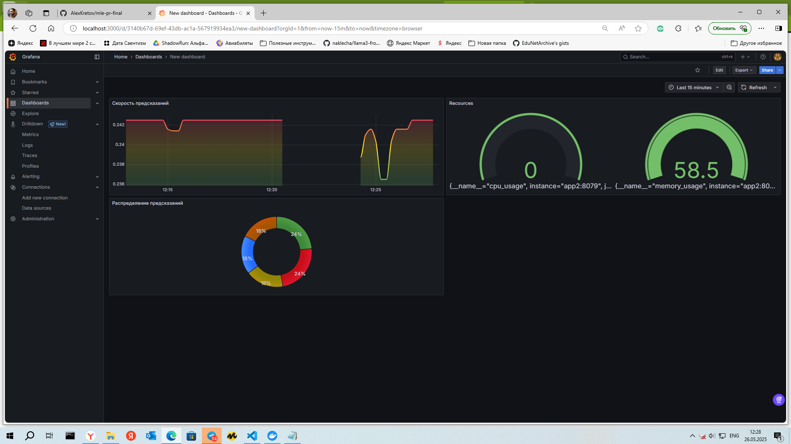

# Задача:
Создание рекомендательной системы для банковских продуктов. 

## Описание:
Имеется набор данных по клиентам банка, где на ряд дат 2015 года приведены основных характеристики килентов и приведён перечень банковских продуктов, которыми они обладают. Необхоидмо создать рекомендательную систему, которая будет рекомендовать клиентам банка продукты, которые могут быть их интересными. В качестве верификации будут использоваться данные из 2016, приведённые в том же файле.  

Мы обучим модель, и на основании неё сделаем микросервис, который будет запускаться из docker-контейнера, давать предсказания по curl-запросу, и вся его деятельность будет логироваться в prometheus, при желании можно будет пронаблюдать дэшборды через graphana.  

## Построение модели   
Сначала мы провели исследовательский анализа данных, для чего используется файл eda.ipynb. В нём же сформулированы основные выводы.
Далее в файле modeling.ipynb была построена модель. И сделаны выводы на основе её метрик.  

### Подготовка среды  
Для начала необходимо создать виртуальную среду и установить в неё необходимые библиотеки. 
*pip install - r requirements.txt*  
Далее, для удобства работы с моделью нам понадобится mlfkow. Для его развёртывания:  
1) объявите системный переменные  
*export $(cat .env | xargs)*  
3)  запустите сервер   
*sh run_mlflow_server.sh*
4) Запустите файл loader.ipynb
### Предобработка данных  
Предобработка данных включает в себя:  
1) Удаление малоинформативных признаков ('indrel','indext','nomprov','tipodom')
2) Замена возраста (age) на корзины.  
3) Замена временных переменных на интервалы ('fecha_alta', 'ult_fec_cli_1t')  
4) Устраненик экстремумов в чиловых переменных (age, renta) (всё что менее 1% квантиля и более 96% квантиля заменялось на соответствующее предельное значение)  
5) Сворачивание маргинальных групп (менее 1%) в 1 категорию other по всем категориальным показателям.  
### Синтез новых признаков   
1) Была использована библиоетка feature-tools для того, чтобы сделать разные агрегации из имеющихся признаков.  
2) Было посчитано общее количество продуктов на последнюю дату 2015 года для каждого клиента.  
3) Были сформированы персональные рекомендации на основе als-модели.  
### Моделирование   
Была построена модель с помощью библиотеки sklearn, в формате pipeline, производящая  
кодировку категориальных признаков, нормализацию числовых признаков, устраняющая малоинформативные признаки.  
Основную предсказывающую функцию взяла на себя модель RandomForestClassifier.  
На базе MLFlow было проведено обучение модели и тюнинг гипер-параметров с помощтью библиотеки optuna.  
### Проверка модели   
Для проверки модели были использованы метрики "roc_auc", "accuracy", "precision","recall", "f1_score". Подобный вывод содержится в тетради modeling.ipynb.  
  
## Развёртывание  
Был создан микросервис на основе FastAPI в файле fastapi/app2.py.  
Для запуска сервиса необходимо выполнить команду:    
*uvicorn app2:app --reload*  
Но для большего удобства микросервис был упакован в контейнер.  
  
Для сборки образа нужно из директории fastapi выполнить команду:  
```  
# команда перехода в нужную директорию  
cd fastapi  
# команда для запуска микросервиса в режиме docker compose  
docker compose build  
docker compose up  
```
Для проверки работы можно править тестовые запросы:  
1)  Адреса сервисов:  

микросервис: http://localhost:<8079>  
Prometheus: http://localhost:<9090>  
Grafana: <http://localhost:<3000>  
2) тестовый запрос к микросервису:  
```
curl -X POST "http://localhost:8079/predict" \  
  -H "Content-Type: application/json" \  
  -d '{"fecha_dato": "2015-05-28", "ncodpers": 444579, "ind_empleado": null, "pais_residencia": "NI", "sexo": "H", "age": 116, "fecha_alta": "1998-07-01", "ind_nuevo": 1.0, "antiguedad": 213, "indrel": 1.0, "ult_fec_cli_1t": "2015-11-24", "indrel_1mes": "4.0", "tiprel_1mes": "R", "indresi": "S", "indext": "N", "conyuemp": null, "canal_entrada": "KCE", "indfall": "S", "tipodom": 1.0, "cod_prov": 23.0, "nomprov": "SALAMANCA", "ind_actividad_cliente": 0.0, "renta": 63830.06999999999, "segmento": "03 - UNIVERSITARIO", "ind_ahor_fin_ult1": 1, "ind_aval_fin_ult1": 0, "ind_cco_fin_ult1": 1, "ind_cder_fin_ult1": 1, "ind_cno_fin_ult1": 1, "ind_ctju_fin_ult1": 0, "ind_ctma_fin_ult1": 1, "ind_ctop_fin_ult1": 1, "ind_ctpp_fin_ult1": 1, "ind_deco_fin_ult1": 0, "ind_deme_fin_ult1": 1, "ind_dela_fin_ult1": 0, "ind_ecue_fin_ult1": 0, "ind_fond_fin_ult1": 0, "ind_hip_fin_ult1": 1, "ind_plan_fin_ult1": 1, "ind_pres_fin_ult1": 1, "ind_reca_fin_ult1": 1, "ind_tjcr_fin_ult1": 0, "ind_valo_fin_ult1": 0, "ind_viv_fin_ult1": 1, "ind_nomina_ult1": 0.0, "ind_nom_pens_ult1": 1.0, "ind_recibo_ult1": 1}'
```
3) Запуск файла test.ipynb - проводит тестирование микросервиса.  
4) Визуализацию метрик можно увидеть через Graphana если загрузить дэшборд graphana.json  
5) 
